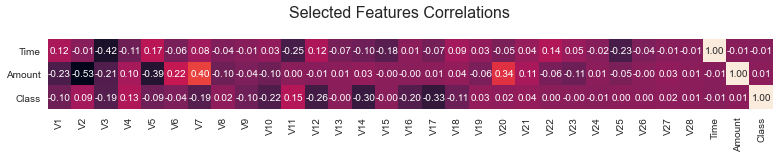
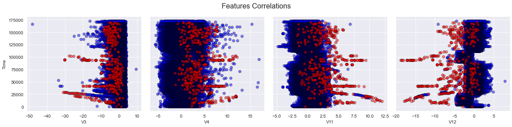
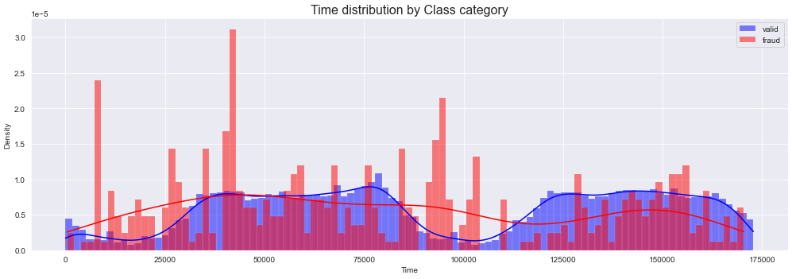

## Credit Card Fraud Detection

### Project Overview
* Developement of a classification model for detecting credit card fraud transactions.
* Data analysis and balance.
* Optimized Logistic Regression, SVM, Random Forest and XGBoost Classification models to reach the best performance.
* Analyzed models errors and feature importances.

### Code and Resources Used 
**Python Version:** 3.7  
**Packages:** pandas, numpy, sklearn, matplotlib, seaborn, imblearn.

### Dataset
The dataset contains information about credit card transactions made in a two days lapse by Europeans cardholders. It has been developed by Worldline and the Machine Learning Group  of ULB (Université Libre de Bruxelles) (http://mlg.ulb.ac.be).  
It is highly unbalanced, consisting of 284,807 transactions/instances, with only 0.17% of positive (fraud) class, and 31 features from which 28 are numerical variables result of a PCA transformation.   
Dataset: https://www.kaggle.com/datasets/mlg-ulb/creditcardfraud 

### EDA
* Features distribution and correlation analysis
* Non-anonymous features grouped analysis

Below are notebook captures as examples of our analysis:

### Models Building and Performance

We tested several classification algorithms and 4 tuned models were developed, been the Random Forest Classifier the one with the best performance:

*	**Logistic Regression**: precision=0.21, recall=0.88, f1-score=0.34. 
*	**SVM**: precision=0.07, recall=0.92, f1-score=0.13.
*	**Random Forest**: precision=0.81, recall=0.87 , f1-score=0.84.
*	**XGBoost**: precision=0.31, recall=0.89, f1-score=0.46.
                                                 
### Metrics Chosen 
**Precision, Recall, F1-score.** 

We chose to use the 3 metrics from the classification report and print the confusion matrix for a clear interpretacion of the results given the unbalance nature of the data. 

---